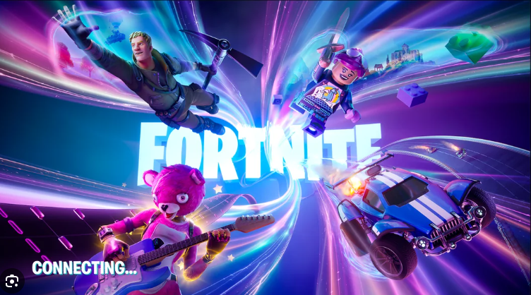
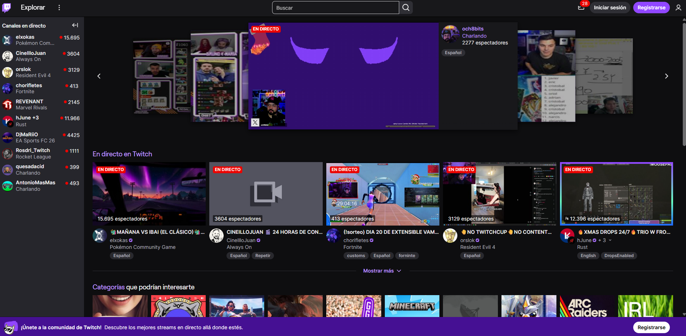

# LA HIBRIDACIÓN: Fortnite - Twitch
- Autor: Jorge Luis Martínez Bermúdez
- Cultura Digital - Multimedia

## Índice
- [Introducción](#introducción)
- [Caso 1: Fortnite](#caso-1-fortnite)
  - [Contexto](#contexto)
  - [Hibridación](#hibridación)
  - [Conclusión Fortnite](#conclusion-fortnite)
- [Caso 2: Twitch](caso-2-twitch)
  - [Contexto](#contexto-1)
  - [Hibridación](#hibridación-1)
  - [Conclusión Twitch](#conclusión-twitch)
- [Conclusión general](#conclusión-general)
- [Bibliografía - Webgrafía](#bibliografía-webgrafía)
  

## **Introducción**
Lev Manovich plantea en El software toma el mando que el ordenador se ha convertido en un metamedio capaz de integrar y transformar medios culturales a través del software. En este contexto, el concepto de hibridación permite analizar cómo las técnicas, interfaces y lógicas propias de medios distintos se fusionan para generar experiencias culturales nuevas, que no pueden entenderse como una simple suma de formatos.
Desde esta perspectiva, el presente ensayo propone el análisis de dos plataformas digitales contemporáneas con el objetivo de reflexionar sobre el papel del software en la creación de medio híbridos. A partir de algunos de los conceptos desarrollados por Manovich, como la modularidad, la automatización, la variabilidad, la base de datos y la transcodificación. Se explorará cómo estas reconfiguran practicas culturales como el videojuego, la emisión audiovisual o la interacción social en el entorno digital actual.

## **Caso 1: FORTNITE**
### Contexto
Fortnite surge inicialmente como un videojuego multijugador desarrollado por la empesa Epic Games, pero con el paso del tiempo ha evolucionado hasta convertirse en una plataforma digital compleja que va más allá del concepto tradicional de videojuego. En la actualidad, Fortnite funciona como un entorno interactivo en línea donde convergen el juego, la comunicación social, la creación de contenidos y el consumo de eventos culturales en tiempo real.
Este proceso de evolución ha sido posible gracias a una infraestructura basada íntegramente en software, que permite la actualización constante del entorno, la incorporación de nuevos modos de juegos y la integración de experiencias diversas dentro de un mismo sistema. A diferencia de los juegos cerrados lineales, Fortnite presenta como un espacio dinámico, donde los contenidos se organizan y distribuyen de forma continua a través de temporadas, eventos y experiencias creadas tanto por la propia plataforma como por los usuarios.
Un elemento clave en este contexto es la dimensión social del entorno. Fortnite no solo propone una experiencia entretenida, sino también un espacio de interacción donde los jugadores pueden comunicarse mediante chat y voz, compartir tiempo y participar colectivamente en actividades que van desde partidas competitivas hasta conciertos virtuales de grandes artistas o eventos narrativos globales. De este modo, el usuario deja de ser un mero jugador para convertirse en un participante activo dentro de un espacio cultural compartido.
Además, Fortnite incorpora herramientas que permiten a los usuarios diseñar y programar sus propias experiencias creativas, que posteriormente pueden ser publicadas y jugadas por otras personas. Esta posibilidad transforma la plataforma en un sistema de creación distribuida, donde el videojuego actúa como base de producción de nuevos contenidos constantes, reforzando su carácter de entorno abierto y reconfigurable.
En conjunto, Fortnite puede entenderse como un juego representativo de las transformaciones culturales gracias al software, en el que distintas prácticas (juego, comunicación, espectáculo y creación) convergen en un mismo entorno digital, sentando las bases para su análisis desde el concepto de hibridación desarrollado por Manovich.

### Hibridación
En una primera aproximación, Fortnite podría interpretarse como un caso de remediación de distintos casos preexistentes. Por un lado, retoma elementos propios del videojuego multijugador tradicional, como la competencia, las reglas y los objetivos lúdicos. Por otro lado, incorpora rasgos del espectáculo audiovisual y del evento en directo, especialmente en el caso de conciertos virtuales y eventos narrativos globales. Asimismo, su dimensión social recuerda a las redes sociales digitales, al permitir la comunicación constante entre usuarios mediante chat y voz, tanto dentro como fuera de las partidas. Incluso podría entenderse como una plataforma de creación similar a otras herramientas de desarrollo, al ofrecer a los usuarios la posibilidad de diseñar y publicar sus propias experiencias interactivas.
Si estos elementos funcionaran de manera independiente, Fortnite podría considerarse una simple superposición de medios remediados. Sin embargo, el análisis del funcionamiento de la plataforma muestra que no se trata de una unión de capas aisladas, sino de una integración estructural de lógicas y técnicas procedentes de medios distintos, mediada en todo momento por el software. La creación de experiencias por parte de los usuarios, la participación en torneos competitivos, la asistencia a eventos culturales o la interacción social nos son módulos autónomos, sino procesos interconectados que se influyen mutuamente dentro de un mismo sistema.
Desde la perspectiva de Manovich, esta integración da lugar a un proceso de hibridación. Fortnite no solo reconfigura medios anteriores, sino que genera una experiencia nueva y coherente en la que el software actúa como mediador central. La plataforma automatiza las reglas, gestiona la distribución de contenidos, organiza la participación de los usuarios y traduce prácticas culturales como el juego, la creatividad o la competición en datos y métricas. De este modo, las actividades tradicionalmente separadas (jugar, crear, competir o consumir espectáculos) se articulan de una misma lógica computacional.
Además, la posibilidad de obtener recompensas económicas, ya sea mediante la creación de experiencias propias y jugadas por otros usuarios o a través de la participación en competiciones oficiales, refuerza esta hibridación. El valor cultural y lúdico se transcodifica en valor económico a partir de sistemas automatizados que calculan la participación y rendimiento, evidenciando cómo el software no solo organiza la experiencia, sino que redefine sus consecuencias.
En este sentido, Fortnite no puede entenderse únicamente como una evolución del videojuego tradicional ni como plataforma de entretenimiento ampliada, sino como un entorno hibrido donde diferentes practicas culturales se integran y se reconfiguran mediante el software.

### Conclusion Fortnite
A partir del análisis realizado, puede afirmarse que Fortnite constituye un caso claro de hibridación de medios en el sentido planteado por Lev Manovich. La plataforma no se limita a remediar formatos preexistentes, sino que integra y reconfigura de forma estructural lógicas procedentes del videojuego, la creación digital, la competición, la comunicación social y la economía de plataforma. 
Este proceso ha sido posible gracias a la aplicación de la lógica del software, que permite la automatización de reglas, la variabilidad de las experiencias, la modularidad de los contenidos y la transcodificación de practicas culturales en datos y métricas. Como resultado, Fortnite se consolida como un entorno programable y reconfigurable que da lugar a nuevas formas de participación, creación y valoración cultural, imposibles sin el papel central del software.
Desde esta perspectiva, Fortnite ejemplifica cómo el metamedio ordenador continúa evolucionando hacia formas hibridas cada vez más complejas, en las que el software no solo soporta los medios, sino que los transforma y redefine profundamente.

---

## **Caso 2: Twitch**
### Contexto
Twitch surge como una plataforma de emisión de video en directo, inicialmente vinculada al ámbito del videojuego, que con el tiempo ha evolucionado hacia un entorno digital complejo basado en la interacción en tiempo real y un papel central del software. En la actualidad, Twitch combina la difusión audiovisual con la participación activa de los usuarios, integrando sistemas de comunicación, automatización y gestión de contenidos dentro de una misma infraestructura.
A diferencia de los modelos tradicionales de broadcasting, la experiencia en Twitch no es unidireccional. La emisión en directo se ve influida por la interacción de la audiencia a través del chat y otros mecanismos de participación, lo que convierte el directo en una experiencia dinámica y variable. Este proceso está mediado por sistemas de software que regulan la visibilidad del contenido, la interacción y el acceso a los directos.
La plataforma organiza y distribuye los contenidos a partir de perfiles de usuario y datos de uso, mediante sistema de recomendación algorítmica que generan experiencias personalizadas. Además, incorpora procesos automatizados como la moderación del chat, el uso de bots y la gestión de la participación, reforzando el papel del software como elemento central de la comunicación.
En conjunto, Twitch puede entenderse como una plataforma digital que reconfigura la emisión audiovisual tradicional a través de la interacción, la automatización y la gestión de datos, lo que la convierte en un caso pertinente para analizar el proceso de hibridación desde la perspectiva de Lev Manovich.

### Hibridación
En una primera lectura, se podría decir que Twitch podría interpretarse como un caso de remediación de medio audiovisuales preexistentes. Su funcionamiento recuerda en parte, a la televisión en directo o al streaming tradicional, al basarse en la emisión continua de contenido audiovisual hacia una audiencia. Asimismo, la presencia del chat y comentarios podría asociarse a formatos propios de foros o redes sociales, mientras que la posibilidad de guardar clips remite a practicas habituales de archivo y reutilización de contenidos digitales.
Sin embargo, al analizar cómo se integran estos elementos dentro de la plataforma, se observa que Twitch no se limita a superponer funcionalidades heredadas de otros medios. La emisión audiovisual, la interacción social, la moderación, la recomendación de contenidos y la participación económica no funcionan de manera independiente, sino que se integran en un mismo sistema y se influyen entre sí a través del software.

Desde la perspectiva de Manovich, este funcionamiento apunta a un proceso de hibridación. En Twitch, la experiencia del directo se construye a partir de la combinación estructural de distintas lógicas mediáticas, organizadas y reguladas por el software. El contenido emitido se ve afectado por la interacción de los usuarios en tiempo real, mientras que sistemas automatizados (como bots, herramientas de moderación o algoritmos de recomendación) intervienen de forma activa en la configuración de la experiencia.
Además, la organización del contenido a partir de perfiles de usuario y datos de uso introduce una dimensión variable que transforma la emisión audiovisual en una experiencia personalizada. De este modo, prácticas tradicionales como ver televisión, participar en una conversación o apoyar económicamente a un creador se integran en un mismo sistema computacional, generando una forma de experiencia que no puede entenderse desde un único medio remediado.
En este sentido, Twitch no puede considerarse únicamente una evolución del streaming audiovisual, sino un entorno hibrido en el que la emisión, la interacción y la automatización se fusionan bajo la lógica del software.

### Conclusión Twitch
El análisis de Twitch permite concluir que la plataforma constituye un caso claro de hibridación de medios, tal como lo define Manovich. Lejos de limitarse a la remediación de la televisión o del streaming tradicional, Twitch integra de manera estructural prácticas de emisión audiovisual, interacción social, gestión algorítmica y automatización dentro de un sistema digital.
La aplicación de la lógica del software resulta fundamental en este proceso, ya que organiza la visibilidad de los contenidos, regula la interacción entre usuarios y emisores y transforma la participación de datos capaces de ser procesados y reutilizados. Como resultado, Twitch configura nuevas formas de experiencia comunicativa en tiempo real, donde la audiencia deja de ser pasiva y pasa a formar parte activa del desarrollo del contenido.
Desde esta perspectiva, dicha plataforma ejemplifica cómo el software actúa como central en la transformación de prácticas comunicativas tradicionales, dando lugar a un medio hibrido que redefine la emisión audiovisual y la interacción social en la cultura digital contemporánea.

## **Conclusión general**
El análisis de los dos casos realizados, desde la perspectiva de la hibridación propuesta por Lev Manovich permite observar cómo el software actúa como un metamedio capaz de integrar y transformar practicas digitales previamente diferenciadas. En ambos casos, no se trata de una simple remediación de medios existentes, sino de procesos de hibridación en los que la lógica del software reorganiza la creación, la distribución y la participación de los usuarios, dando lugar a experiencias nuevas y coherentes. Estas plataformas ejemplifican cómo en la cultura digital contemporánea, el software no solo soporta los medios, sino que redefine profundamente su funcionamiento y sus consecuencias culturales.

## **Bibliografía - Webgrafía**
- Fortnite [en línea]. Disponible en: https://www.fortnite.com/?lang=es-ES
- **Twitch** [streaming]. Disponible en: https://www.twitch.tv
- **Fonaments i evolució de la multimèdia** [en línea]. Disponible en: https://cultura-digital.aula.uoc.edu/1-4-la-hibridacion-de-los-medios/
- MANOVICH, Lev. (2013). **"El software toma el mando"** [en línea]. Lugar de publicación: Barcelona: Editorial UOC, 2013.

## **Licencia**
Este trabajo se publica bajo una licencia **Creative Commons Atribución/Reconocimiento-CompartirIgual 4.0 (CC BY-SA 4.0)**.  
https://creativecommons.org/licenses/by-sa/4.0/

El texto del ensayo ha sido elaborado por el autor y se distribuye bajo dicha licencia.

Las imágenes utilizadas corresponden a **capturas de pantalla** de las páginas oficiales de **Fortnite (Epic Games)** y **Twitch**, empleadas con fines exclusivamente académicos y de análisis crítico. Dichos materiales son propiedad de sus respectivos titulares y se incluyen únicamente como referencia contextual.
